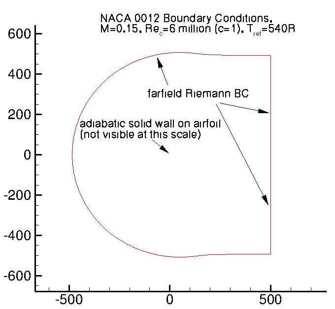
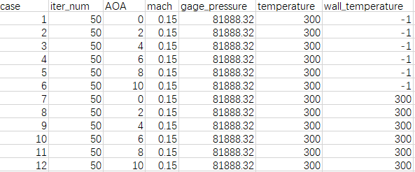
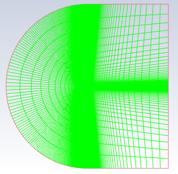
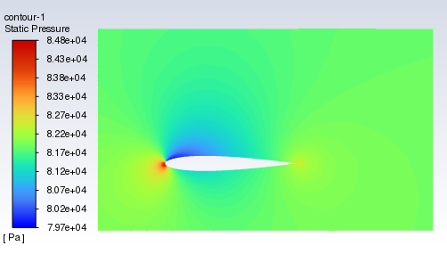

# PyFluent介绍

Fluent 2022R2开源了PyFluent库（目前是0.11.0版本），PyFluent是PyAnsys生态系统的一部分，它允许开发者在选择的Python环境中与其他PyAnsys库和外部Python库一起使用Fluent。便于开发者基于python实现fluent的自动化求解，比如：

- 使用本地Ansys安装程序启动Fluent
- 使用Fluent的TUI（文本用户界面）命令来实现网格划分和求解器功能
- 使用Fluent的内置后处理功能

开发者可以使用PyFluent以编程方式创建、交互和控制一个Fluent会话，以创建自己的定制工作空间。 此外，开发者可以使用PyFluent通过高度可配置的定制脚本来提高生产力。

官方文档：https://fluent.docs.pyansys.com/index.html

官方PyFluent库地址：https://github.com/pyansys/pyfluent

# 安装

方式1：pip安装

```python
pip install ansys-fluent-core
```

方式2：本地下载安装

```python
git clone https://github.com/pyansys/pyfluent.git
cd pyfluent
pip install pip -U
pip install -e .
python codegen/allapigen.py  # Generates the API files
```

为方便使用，可以配套安装Fluent参数化模块及后处理模块。利用下面的命令安装：

```python
pip install ansys-fluent-parametric
pip install ansys-fluent-visualization
```

参数化模块官方文档：https://fluentparametric.docs.pyansys.com/

后处理模块官方文档：https://fluentvisualization.docs.pyansys.com/

# 本开源脚本介绍

以**Langley Research Center**的**2D NACA 0012 Airfoil Validation Case**为例，使用此脚本批处理计算同一套网格不同边界条件的流场，获取对应case的机翼表面气动力并提取目标局部区域流场数据。



1. data.csv参数配置文件，在此文件中添加所需变量在不同case下的参数

   

   iter_num：迭代步数为测试需要节约时间仅跑50步

   AOA：来流攻角

   mach：来流马赫数

   gage_pressure：压力远场表压

   temperature：来流温度

   wall_temperature：翼型恒温壁面温度。"-1"表示绝热壁面条件

2. 代码介绍，与原本Fluent GUI求解步骤相同。

   > 启动fluent，载入网格，检查有无负体积网格
   >
   > ```python
   > import_filename="naca0012.cas"
   > #fluent启动界面，2d双精度，4核，mode="solver"求解模式，show_gui=True同步显示fluent
   > solver = pyfluent.launch_fluent(version="2d",precision="double",
   >                                 processor_count=4,show_gui=True, mode="solver"求解模式	)
   > #读入网格
   > solver.file.read(file_type="case", file_name=import_filename)
   > #检查网格
   > solver.tui.mesh.check()
   > ```

   > 定义模型：开启能量方程，sst k-omega
   >
   > ```python
   > solver.setup.models.energy.enabled = True
   > solver.tui.define.models.viscous.kw_sst('yes')
   > solver.setup.models.viscous.k_omega_options.kw_low_re_correction=False
   > solver.setup.models.viscous.options.viscous_heating=True
   > ```
   
> 定义材料：理想气体，定义操作压力
   >
   > ```python
   > solver.setup.materials.fluid['air'].density.option='ideal-gas'
   > solver.setup.materials.fluid['air'].viscosity.option='sutherland'
   > solver.tui.define.operating_conditions.operating_pressure('101325')
   > ```
   
> 定义求解算法，压力速度耦合，开启全局伪时间，定义残差检测
   >
   > ```python
   > solver.tui.solve.set.p_v_coupling(24) # Coupled
   > solver.tui.solve.set.gradient_scheme('yes')    # Green-Gauss Node Based
   > solver.solution.methods.pseudo_time_method.formulation.coupled_solver='global-time-step'
   > solver.tui.solve.monitors.residual.check_convergence('yes','no','no','no','no','no')
   > solver.tui.solve.monitors.residual.convergence_criteria('1e-7')
   > solver.tui.solve.monitors.residual.monitor('yes','yes','yes','yes','yes','yes')
   > solver.tui.solve.monitors.residual.plot("yes")
   > solver.tui.solve.monitors.residual.print("yes")
   > ```
   
> #创建一个函数。目的：创建监控文件+保存参数文件+绘图
   > #输入参数攻角AOA
   > #无返回值
   > `def create_report(need_aoa):`
   >
   > 
   >
   > #根据data数据里的case设置边界条件和迭代次数
   >
   > `for data in data_all:`
   >
   > ## 详情见`pyfluent_naca0012.ipynb`
   


# 运行过程（show_gui=True）


## 案例求解域



## 目标局部流场



## 生成文件

- drag_file_aoa_xx，lift_file_aoa_xx：气动力及气动力系数计算输出文件
- naca0012_aoa_xx.cas，naca0012_aoa_xx.dat：每个cas计算完成后的数据
- loc_naca0012_aoa_xx.txt：目标局部区域流场信息
- cl_cd.csv：记录每一个cas的攻角以及cl，cd